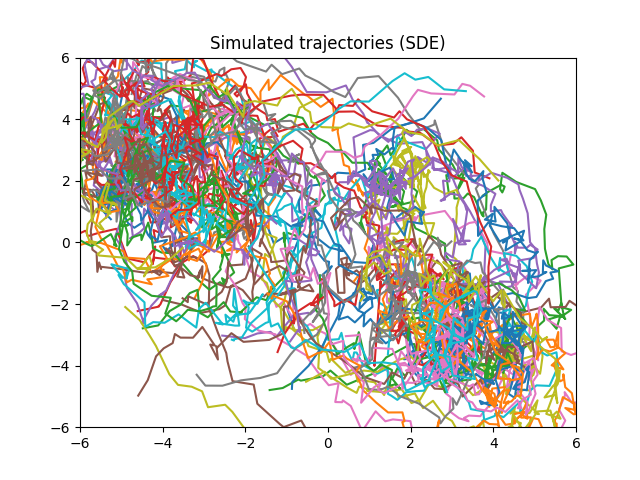

<h1 align="center"">VarCT: A Variational Algorithm for Continuous-Time
Modeling<h1>

<p align="center">
  
  &nbsp;
  &nbsp;
  &nbsp;
  
</p>

This is the repository for a python implementation of the algorithm presented
in the book chapter 
```
H. Meinlschmidt, M. Sons, & M. Stemmler: A Variational Approach to Continuous
Time Dynamic Models.
``` 
The implementation was written by Hannes
Meinlschmidt to whom questions and comments are welcome at *[lastname]
at math.fau.de*. 

See [below](#how-to-reproduce-the-results-from-the-book-chapter) for
instructions regarding reproducing the results from the book
chapter. Otherwise, feel free to play with the `simulate`
[CLI](#command-line-interface-options) and various settings to generate a data set. 

## What the algorithm does
It is an optimization
algorithm which, given sets of data, each
consisting of a number of points in space, determines a quadratic
matrix driving a linear ordinary differential equation such that the trajectories
generated by the differential equation match the points in space in a
least-squares optimal way over the whole data set. 

It can also optimize for
so-called intercepts, that is, forcing functions in the differential
equations. 

The optimizer used is a BFGS algorithm from `scipy` which is fed
with a gradient for the least-squares objective function which was calculated
analytically by adjoint calculus. 

Details can be found in the book chapter or in forthcoming publications.

## How to reproduce the results from the book chapter
> [!IMPORTANT]
> In the book chapter, we applied the algorithm to a particular set of data from
> the [German Socio-Economic Panel (SOEP)](https://www.diw.de/en/diw_01.c.615551.en/research_infrastructure__socio-economic_panel__soep.html)
> which is mainted by the German Institute for Economic Research (DIW
> Berlin). Usage of the SOEP data is free of charge for anyone working at a
> scientific research institution, but unfortunately, per the contract with DIW
> Berlin I am not allowed to supply the data file directly within this
> repository, so you need to request access to the SOEP data yourself. 

That being said, in the **data_processed** folder there is a python snippet
which processes the rather unwieldly large SOEP **pl.csv** file to filter only
the relevant columns for our application case. The algorithm then works on the
thus produced **pl_filtered.csv** file.

Once you have the **pl_filtered.csv** file in the **data_processed** folder, you can reproduce the
results in the book chapter with
```
python VarCT_optimize.py
```
This will select the default number of **1%** of participants in the data randomly and
use these in the algorithm. To change this number, use the `-td percent` command line
interface, e.g.
```
python VarCT_optimize.py -td 10
```
to select **10%** of participants randomly.

## Command Line Interface options

 * 

## Requirements
The code was written for and tested with **python 3.10** and I do not give any
guarantees that it works on other versions.
 
> [!WARNING] A word of warning: I have tried to put reasonable comments in the
> code but it is an organically grown code and I am not a python
> professional. Probably there are several rather inefficient and inelegant
> solutions in there, not to speak of possible bugs. However, the main
> functionality should definitely be correct. Eventually I would consider
> rewriting large aspects of the code, especially in order to facilitate usage also on other
> data sets.
